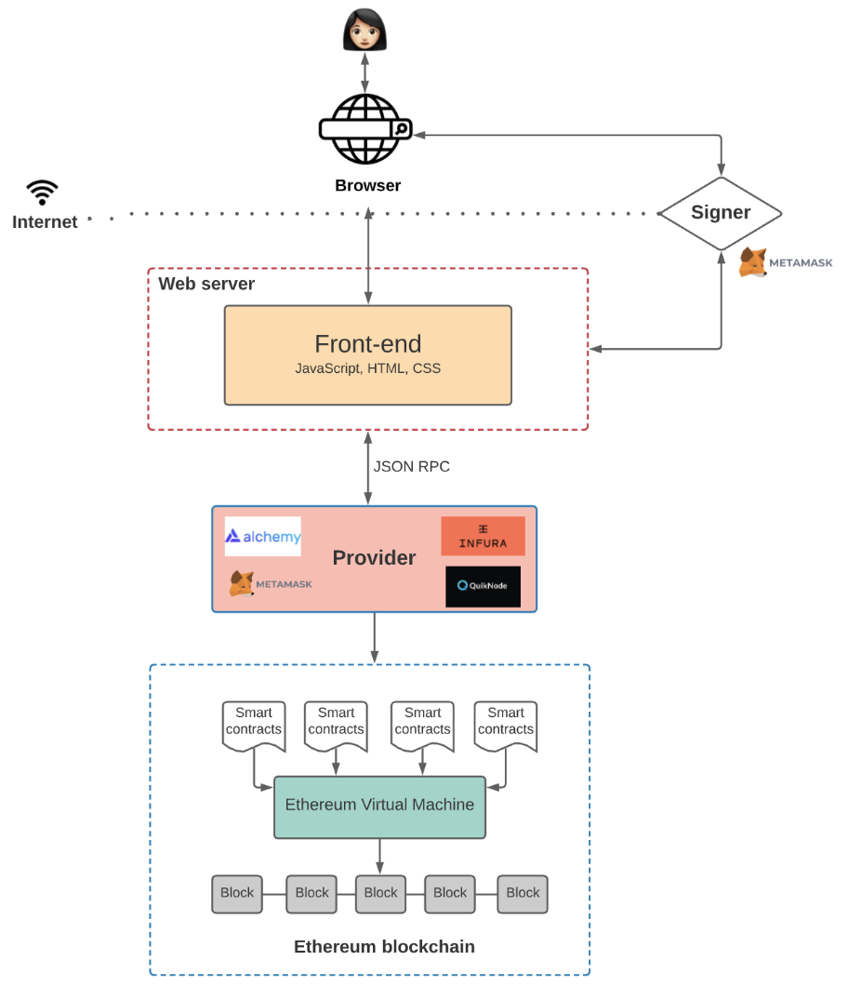
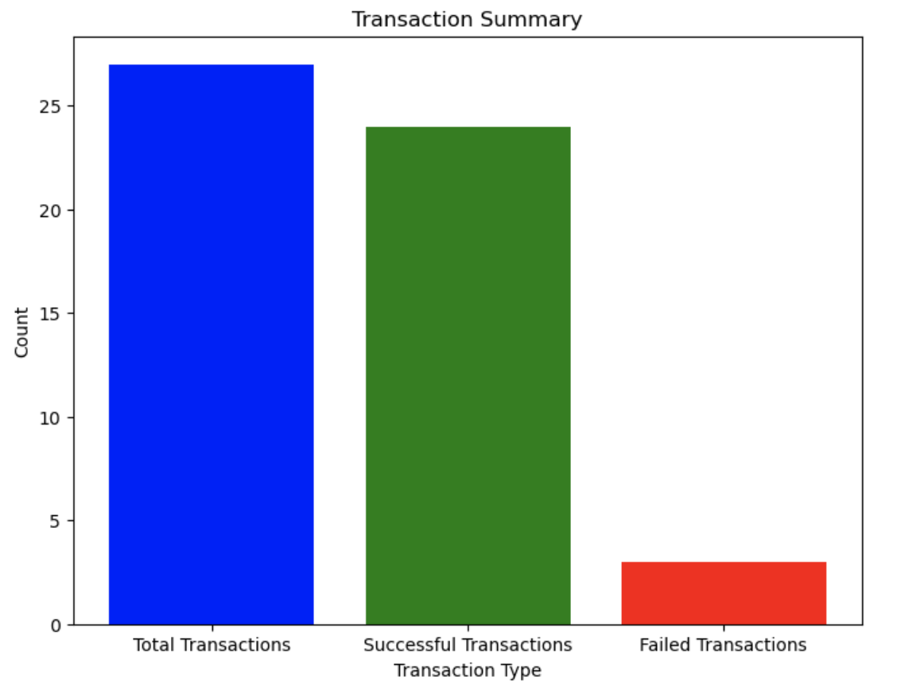
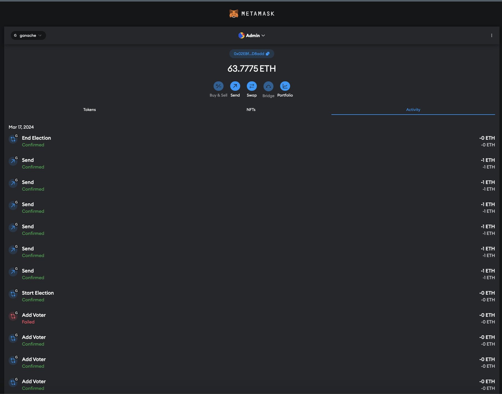
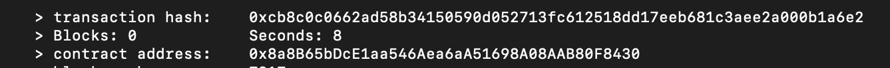
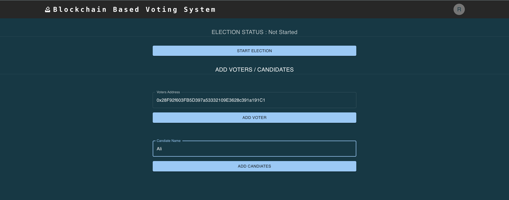
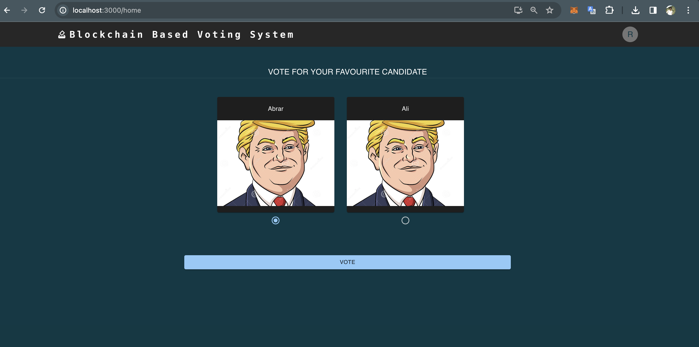
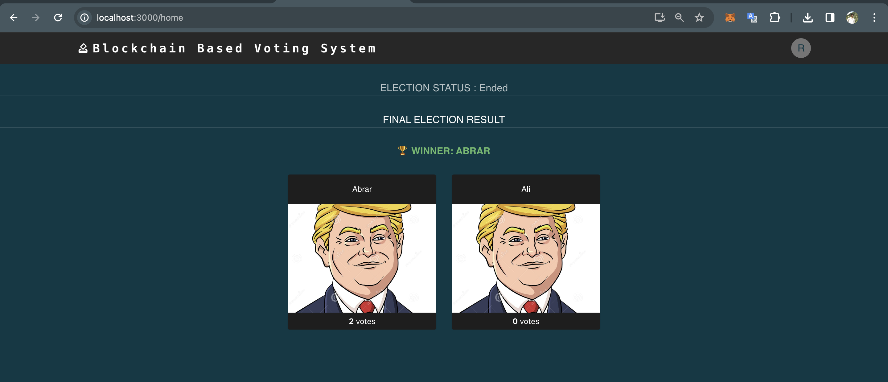

# Industry track

## Election using Blockchain Distributed system

## About the project

The primary goal of this project is to make use of blockchain technology to construct a voting mechanism. The project seeks to offer transparent and secure environment for carrying out various voting procedures. Blockchain is used by the distributed system to guarantee integrity and immutability of the vote records.
Voter nodes and miner nodes play the two primary functions in the decentralized blockchain concept that underlies the system design. Voter Nodes initiate transactions to cast votes on behalf of particular users who are taking part in the voting process. By using consensus mechanisms, Miner Nodes, functioning as servers, verify these transactions, include them in blocks, and mine new blocks. The system includes voting, verification, and blockchain consensus services, which are all enabled by a middleware layer that uses a particular blockchain protocol (such as Ethereum). The information is kept on a blockchain ledger, which preserves an unchangeable record of the election outcomes.


## 1. Architecture

Our voting system's architecture is built upon a decentralized blockchain network topology. By using this architecture, the system is protected against failures and assaults and eliminates the possibility of a single point of failure. In this design, transactions are verified, recorded, and kept in a decentralized fashion inside a distributed network that is formed by peer-to-peer communication between nodes (miners and voters). Ensuring the integrity of the electoral process, the architecture allows vote records to be transparent, secure, and immutable.

 &nbsp;


### Roles of System Components:
•	Admin: Responsible for adding voters and candidates to the voting system, ensuring proper management and integrity of the voting process.
•	Voters: Users who cast votes through the client interface, initiating transactions to record votes on the blockchain ledger.
•	Frontend: It defines the UI logic, but the frontend also communicates with the application logic defined in smart contracts.
•	Miners: Responsible for adding new blocks to the blockchain, validating transactions, and ensuring node consensus.

### Services:

•	Admin Services: These services are in charge of maintaining the voting system's functionality, which includes adding candidates and voters, making sure the voting process is fair, and supervising system maintenance duties.

•	Voter Services: These services are provided to users who utilize the voting interface to cast ballots. They make voting, authentication, registration, and user management tasks easier.


•	Blockchain Services: Consists of services that are utilized for the recording and verification of votes through the implementation of smart contracts on the blockchain. These services guarantee that voting transactions are entered onto the blockchain ledger in a transparent and safe manner.

### Interactions:

•	Transaction Submission: Users provide the network their votes.
•	Validation: Validators confirm that transactions are legitimate.
•	Consensus: When nodes agree to add a new block to the blockchain.

### Middleware/External Services:
•	Blockchain Platform: Utilizing Ethereum or similar blockchain platforms (e.g., Ganache) as middleware for blockchain features.
•	Libraries for cryptography: used for safe transactions

### Data: 
•	An immutable ledger that records voting transactions

## 2. Implementation
Describe how you implemented the functionality for each system component (e.g. client and server), including software solutions and possible hardware. 

We are employing a number of software solution components to construct our blockchain-based voting system. Below is a breakdown of how we've implemented the functionality for each system component:

### Client:

•	Implemented with the use of web-based technologies like JavaScript, HTML, and CSS.
•	Admin add voters, candidates, start and stop election.
•	To cast their ballots, verify their identities, and register for the polls, users communicate with the client interface.
•	Clients (both amin and voters) don't need any special hardware because they may use desktop or mobile web browsers to access the system.

### Server/Node (Validator):

Implemented using blockchain-based platform Ethereum.
Validators are in charge of verifying, validating, and deciding whether or not to add transactions to the blockchain.
Hardware specifications vary depending on the blockchain platform selected. Strong servers with sufficient RAM and processing capacity are usually needed.

### Middleware/External Services:

•	Using  Ethereum platforms to serve as the middleware for blockchain features.
•	Using cryptography libraries to guarantee safe blockchain network transactions.
•	Middleware does not have any special hardware requirements because it is hosted on the Ethereum blockchain network.

### Blockchain Ledger:

•	Implemented as the Ethereum blockchain, which keeps an unchangeable record of every vote that is conducted.
•	Maintains security and transparency by keeping track of all voting transactions in smart contracts that are implemented on the Ethereum blockchain.
•	The quantity of transactions and the Ethereum network settings determine how much storage is needed.

## 3. Communication

### HTTP/TCP Communication: 
The browser requests the React application, it establishes a communication channel over HTTP/TCP. This communication layer is essential for transferring HTML, CSS, JavaScript, and other resources required for rendering the application.

### JSON-RPC Protocol:
The frontend doesn't directly access blockchain data; it interacts with functions exposed by a blockchain node (through the Web3 library). This mirrors RPC, where a client invokes procedures on a remote server. Web3 communication typically uses JSON-RPC, a lightweight protocol for remote procedure calls over HTTP. This aligns with common RPC implementations. Web3 instance uses HTTPProvider, which communicates with a local Ethereum node running at "http://127.0.0.1:7545". This HTTPProvider acts as the intermediary for RPC communication between the frontend and the blockchain node.

## 4. Naming

### Flat Naming for Local Development Blockchain:
When running locally, we use a flat naming scheme. The address "http://127.0.0.1:7545" serves as a flat name for the local development blockchain network. This flat address allows components, such as the frontend, to directly access the blockchain running locally for development purposes.

### Structured Naming for Ethereum Blockchain:
Within the Ethereum blockchain network, a structured naming scheme is utilized. Each node in the blockchain network has a unique Ethereum address, which serves as its identifier. Components interact with the Ethereum blockchain using its built-in structure, such as contract addresses, transaction hashes, and block numbers, for identification and communication.

## 5. Coordination

•	Our project leverages Ethereum's consensus mechanism (currently Proof of Work or transitioning to Proof of Stake) for coordination among nodes.
•	Smart contracts deployed on the Ethereum blockchain define the roles and responsibilities of components, such as voter nodes and miner nodes, ensuring proper coordination during the voting process.

## 6. Consistency and replication

•	The consensus mechanism of Ethereum, which guarantees that all nodes concur on the ledger's current state, maintains consistency within the Ethereum blockchain network.
•	The blockchain ledger is replicated by Ethereum nodes, providing fault tolerance and resilience against node failures.

## 7. Fault tolerance

•	An intrinsic feature of the Ethereum blockchain protocol is fault tolerance.
•	The consensus method used by Ethereum makes sure that the network can withstand failures and come to a consensus about the legitimacy of transactions.
•	Enhancing fault tolerance and resistance against node failures is achieved by redundancy in data storage across many Ethereum nodes.

## 8. Security
Design: If your project implements security, authentication, authorization mechanism, describe it here briefly. Refer back to section 1 and describe the components and their roles in more detail. Again, a picture is worth thousand words, see examples in the course book.
•	To guarantee the integrity and privacy of voting transactions, security measures are essential to our Ethereum-based voting system implementation.
•	Public-private key cryptography on Ethereum is used for permission and authentication, limiting voting to only those who are eligible to cast ballots and see voting information.
•	Digital signatures and hashing are two cryptographic techniques used by smart contracts on the Ethereum blockchain to safeguard voting transactions and stop manipulation with the blockchain record.

## Evaluation

### Number of Messages / Lost Transactions:
•	Keep track of how many messages(transactions) were sent and received in each scenario.
•	Determine whether any missed messages or failed transactions have occurred.

| No | Initiator | Type of Transaction | No of Transactions | Successful | Failed |
|----|-----------|---------------------|---------------------|------------|--------|
| 1  | Admin     | Start Election      | 1                   | 1          | 0      |
| 2  |           | Add Voter           | 11                  | 10         | 1      |
| 3  |           | Add Candidate       | 2                   | 2          | 0      |
| 4  |           | End Election        | 1                   | 1          | 0      |
| 5  | Voters    | Vote                | 12                  | 10         | 2      |
|    |           | **Total Transactions** | **27**            | **24**     | **3**  |

Note: The failed transactions were because Admin was adding a voter multiple times and Voter was voting multiple times.
 &nbsp;
 &nbsp;
 &nbsp;

 Admin Page to Add Voter and Candidates to start Election

### Latency:
•	Calculate how long it takes to start, process, and add a transaction to the blockchain.
It takes approximately 8 seconds on average for a complete transaction from start to adding to the blockchain.
 &nbsp;

## Results
1. Admin Page to Add Voter and Candidates to start Election
 &nbsp;

Voting Page to Cast Vote and End Election
 &nbsp;

Election Announcing Page 
 &nbsp;


## Built with:
Download Ganache https://archive.trufflesuite.com/ganache/

## Getting Started:
Instructions on setting up your project locally
### Step 1. Clone the project

```git clone https://github.com/seonabrar/Distributed_Systems_Project.git```

### Step 2. Start Ganache

Open the Ganache GUI client to start the local blockchain instance.

### Step 3. Compile & Deploy Election Smart Contract

```truffle migrate --reset```

We must migrate the election smart contract each time restart ganache.

### Step 4. Configure Metamask

- Unlock Metamask
- Connect metamask to the local Etherum blockchain provided by Ganache.
- Import an account provided by Ganache.

### Step 5. Run the Front End Application

```powershell
cd .\main
yarn install
yarn start
```

Visit URL in your browser: <http://localhost:3000>

## Acknowledgments:
list resources you find helpful

